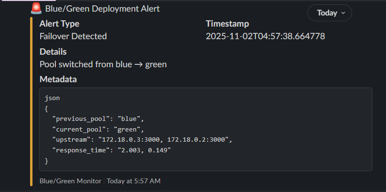
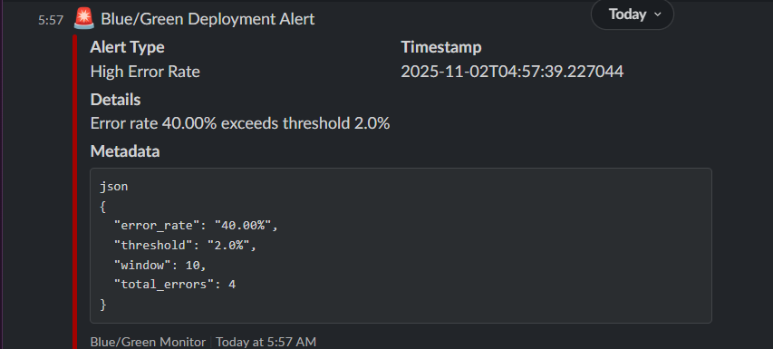

# stage-2

Minimal infra repo for an nginx front with blue/green backend containers.

Quick start intro

### Setup Instructions

1. Copy `.env.example` to `.env` and edit values (especially `SLACK_self.webhook_url`).
2. Start all services:
   ```bash
   docker-compose up -d
   ```
3. (Optional) To restart or reload nginx after changing `ACTIVE_POOL`:
   ```bash
   docker-compose up -d nginx
   docker-compose exec nginx nginx -s reload
   ```

### Chaos Testing Steps

- Induce errors in the blue or green backend:
  ```bash
  curl -X POST http://localhost:8081/chaos/start?mode=error
  # or for green
  curl -X POST http://localhost:8082/chaos/start?mode=error
  ```
- Stop chaos mode:
  ```bash
  curl -X POST http://localhost:8081/chaos/stop
  curl -X POST http://localhost:8082/chaos/stop
  ```
- Generate requests to increase error rate and trigger alerts.

### Viewing Logs & Verifying Alerts

- **NGINX logs:**
  - On host: `./logs/access.log`
  - In container: `/var/log/nginx/access.log`
- **Alert Watcher logs:**
  - Check watcher container output for alert activity.
- **Verify Slack Alerts:**
  - Alerts are sent to the configured Slack channel via webhook.
  - Example alert messages are shown below in the Alert Watcher section.

### Screenshots

Slack alert screenshots:
- 
- 

Notes
- This repository contains deployment artifacts (docker-compose, nginx templates, CI workflow). It does not contain application source code — the `BLUE_IMAGE` and `GREEN_IMAGE` environment variables should point to built container images.
- The nginx template expects to be rendered by the container command configured in `docker-compose.yml`.

Ports & grader expectations
- Nginx public entrypoint (host): http://localhost:8080
- Blue service direct (host): http://localhost:8081
- Green service direct (host): http://localhost:8082

Manual toggle / Active pool
- The `ACTIVE_POOL` env var controls which backend is primary. By default `ACTIVE_POOL=blue`.
- To change active pool manually:

```bash
# edit .env and change ACTIVE_POOL to 'green' then reload nginx in the container
docker-compose up -d nginx
docker-compose exec nginx nginx -s reload
```

Chaos endpoints (supplied by the app images)
- POST /chaos/start?mode=error to induce failures on the target app
- POST /chaos/stop to stop chaos
- GET /healthz and GET /version to validate responses and headers (X-App-Pool, X-Release-Id)

Files of interest
- `docker-compose.yml` — docker compose for nginx + blue/green apps
- `nginx/` — nginx template and configuration
- `workflows/ci-cd.yml` — GitHub Actions deploy workflow

Improvements
- Add a registry-based CI (build & push images) and have the server pull images instead of building on the server.
- Add health-check endpoints on app containers and validate before switching `ACTIVE_POOL`.

---

## Support / Contact

For support or incident escalation, contact:
- Primary: DevOps Team (devops@example.com)
- Backup: Project Maintainer (maintainer@example.com)

## Alert Watcher

A containerized alerting system monitors NGINX logs for failover and high error rate events, sending Slack notifications when thresholds are exceeded.

- **Service:** `alert_watcher` (see `docker-compose.yml`)
- **Log Source:** `/logs/access.log` (mounted from host)
- **Alerts:**
  - Failover (pool switch)
  - High error rate (5xx responses)
- **Notification:** Slack webhook (set `SLACK_self.webhook_url` in `.env`)

### Usage

1. Ensure `SLACK_self.webhook_url` is set in your `.env` file.
2. The watcher runs automatically with `docker-compose up -d`.
3. Alerts and meanings are detailed in [`runbook.md`](./runbook.md).

### How to Trigger Alerts

- **Failover Alert:**
  - Change the `ACTIVE_POOL` variable in `.env` (from `blue` to `green` or vice versa).
  - Reload nginx:
    ```bash
    docker-compose up -d nginx
    docker-compose exec nginx nginx -s reload
    ```
  - The watcher will detect the pool switch and send an alert.

- **Error Rate Alert:**
  - Induce errors in a backend (e.g., using the chaos endpoint):
    ```bash
    curl -X POST http://localhost:8081/chaos/start?mode=error
    ```
  - Generate requests to the affected service to increase 5xx error rate.
  - The watcher will alert if error rate exceeds the threshold.

### Example Slack Alert

```
[ALERT] Failover detected: Active pool switched from blue to green at 2025-10-31T22:00:00Z
```

or

```
[ALERT] High error rate detected: 5.2% 5xx responses in last 5 minutes
```

---
